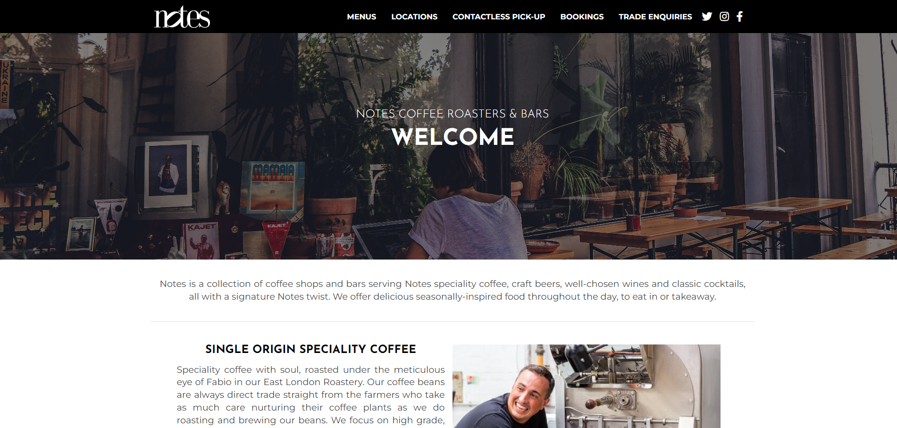

# Restaurant Website

This is a website for a fictional restaurant named "Delicious Bites," designed to showcase the restaurant's menu, locations, and contact information.

## Table of Contents

- [Description](#description)
- [Features](#features)
- [Installation](#installation)
- [Usage](#usage)
- [Credits](#credits)
- [License](#license)

## Description

The "Delicious Bites" website provides an online platform for customers to explore the restaurant's menu offerings, view its various locations, and get in touch via the provided contact information. The website is built using HTML, CSS, and JavaScript.

## Features

- Responsive design optimized for different devices and screen sizes.
- Sections for displaying the restaurant's menu, locations, and contact details.
- Integration with Google Maps for displaying restaurant locations.
- Utilization of Font Awesome for icons.
- A visually appealing layout with high-quality images to entice visitors.
- Contact form for customers to send inquiries or feedback.

## Installation

Clone the repository using SSH:

```bash
git clone git@github.com:Ginjak/Notes.git
```

## Usage

1. [Live Demo](https://heuristic-haibt-95a769.netlify.app/)
2. [GitHub Repository](https://github.com/Ginjak/Notes)



## Credits

- Font Awesome: [https://fontawesome.com/](https://fontawesome.com/)
- Google Maps Platform: [https://cloud.google.com/maps-platform](https://cloud.google.com/maps-platform)
- Images sourced from Unsplash: [https://unsplash.com/](https://unsplash.com/)
- Brad Traversy's Modern HTML & CSS course on Udemy for inspiration and learning resources.

## License

This project is licensed under the MIT License - see the [LICENSE](LICENSE) file for details.
